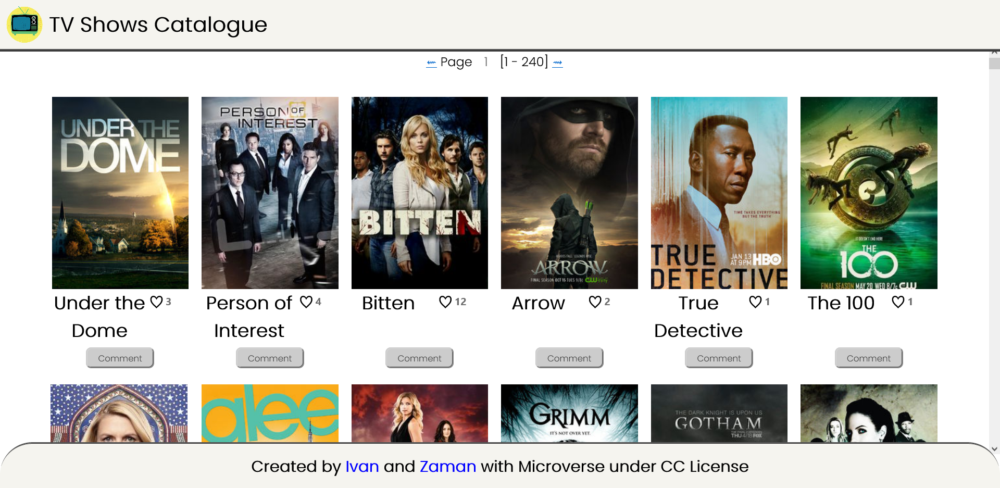

# TV Shows Catalogue

> This website shows a catalogue of all available TV shows, with the option to like your favorite shows or share your comments about them.

Additional description about the project and its features.

## Built With

- Html, CSS, JavaScript
- Webpack, Jest

## Live Demo

[Live Demo Link](https://qwibbler.github.io/Capstone-Js-and-Networking/)

## Getting Started

To get a local copy up and running follow these simple example steps.

### Prerequisites

- Node.js

### Setup

1. Open the terminal and clone the project using `git clone https://github.com/qwibbler/Capstone-Js-and-Networking.git`

### Install

1. `cd` into the project folder and run `npm install`
2. Run the command `npm start`

### Usage

1. Click on a show's picture to see more information.
1. Click on the heart to *Like* your favorite shows.
2. Click on the comment button to share your views on any show.

### Run tests

## Authors

👤 **Humaira Zaman**

- GitHub: [@qwibbler](https://github.com/qwibbler)
- Twitter: [@hmemaz](https://twitter.com/hmemaz)
- LinkedIn: [Humaira Zaman](https://www.linkedin.com/in/hmemaz1994/)

👤 **Ivan**

- GitHub: [@githubhandle](https://github.com/githubhandle)
- Twitter: [@twitterhandle](https://twitter.com/twitterhandle)
- LinkedIn: [LinkedIn](https://linkedin.com/in/linkedinhandle)

## 🤝 Contributing

Contributions, issues, and feature requests are welcome!

Feel free to check the [issues page](../../issues/).

## Show your support

Give a ⭐️ if you like this project!

## Acknowledgments

- This website uses information from the free [TV Maze API](https://www.tvmaze.com/api)
- Inspired by Microverse's wireframe.

## 📝 License

This project is [MIT](./MIT.md) licensed.
